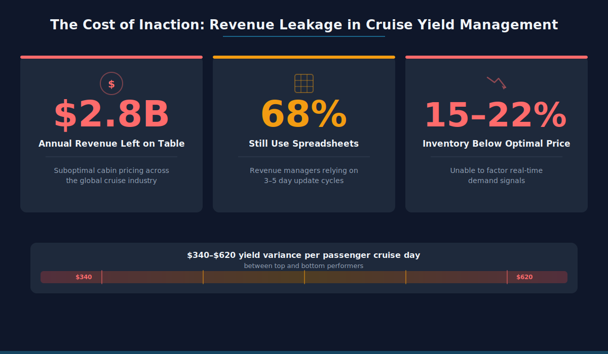
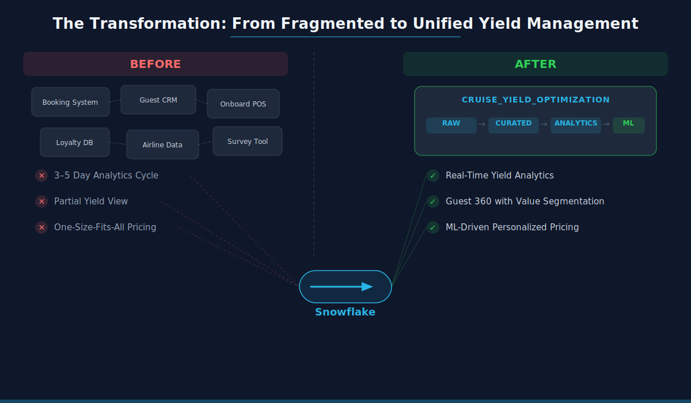
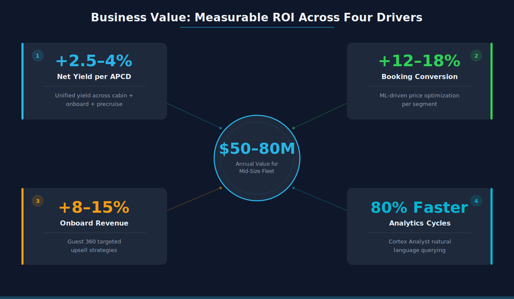
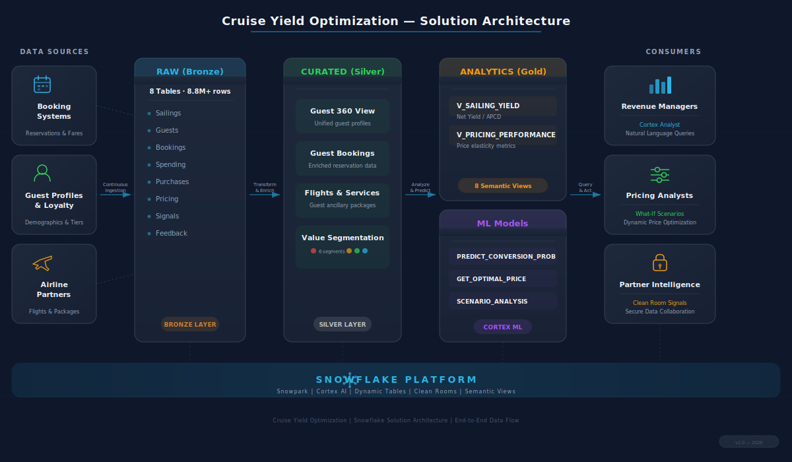
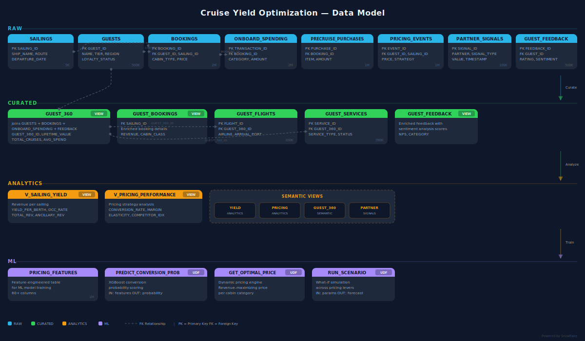

# Cruise Yield Optimization

## Turning Pricing Guesswork into Revenue Precision with Snowflake

---

## 1. The Cost of Inaction

**$2.8 billion** is left on the table annually across the global cruise industry through suboptimal cabin pricing alone.

In 2023, a major cruise operator reported that a **single mispriced sailing season** in the Mediterranean resulted in $47M in unrealized revenue -- cabins sold too early at steep discounts while late-booking demand surged. The revenue management team had the data, but it lived in six different systems. By the time analysts assembled a pricing view, the booking window had closed.

The numbers tell the story:

- **68%** of cruise revenue managers still rely on spreadsheet-based pricing models that take 3-5 days to update (Deloitte, 2024)
- **$340-$620 per passenger cruise day** in yield variance exists between top-performing and bottom-performing ships in the same fleet
- **15-22%** of cabin inventory sells below optimal price due to inability to factor real-time demand signals

The cruise industry operates on razor-thin yield margins. A 1% improvement in net yield per available passenger cruise day (APCD) translates to **$50-80M annually** for a mid-sized fleet. Yet most operators cannot answer basic yield questions without a multi-day analyst sprint.

---

## 2. The Problem in Context

Cruise line revenue management teams face five interconnected challenges:

### Fragmented Guest Intelligence
Guest profiles, booking history, onboard spending, loyalty data, and feedback surveys live in separate systems. A Diamond+ loyalty member who spends $2,800 per cruise onboard looks identical to a first-time Budget Cruiser in the pricing engine because the systems do not talk to each other.

### Static Pricing in a Dynamic Market
Cabin pricing models update weekly at best. Meanwhile, airline partner signals shift hourly, competitor pricing changes daily, and booking velocity fluctuates by the minute. A 5-day lag between market signal and price adjustment means 15-20% of pricing decisions are made on stale data.

### No Unified Yield View
Net yield per passenger cruise day -- the single most important metric in cruise economics -- requires joining cabin revenue, onboard spending, pre-cruise purchases, and occupancy data across multiple systems. Most operators see partial pictures: cabin revenue OR onboard spend, never the true net yield.

### Conversion Blind Spots
When a guest views a cabin price and does not book, the reason is invisible. Was the price too high for their sensitivity level? Was the cabin class wrong for their loyalty tier? Without conversion analytics tied to guest profiles, pricing teams cannot learn from lost bookings.

### Partner Signal Isolation
Airline demand signals -- flight pricing, seat availability, booking velocity to cruise ports -- are powerful leading indicators of cruise demand. But these signals sit in clean room environments, disconnected from the pricing workflow.

---

## 3. The Transformation

| Dimension | Before | After |
|-----------|--------|-------|
| **Yield Visibility** | Partial views across 6+ systems, 3-5 day assembly time | Unified net yield per APCD in real-time across all revenue streams |
| **Guest Intelligence** | Siloed profiles, no value segmentation | Guest 360 with 6 value segments, CLV scoring, spending propensity |
| **Pricing Decisions** | Weekly spreadsheet updates, gut-feel adjustments | ML-driven conversion probability and optimal price recommendations per guest segment |
| **Partner Signals** | Disconnected airline data, no anomaly detection | Clean room integration with automated anomaly alerts on flight demand |
| **Analytics Access** | SQL-only, analyst bottleneck | Natural language querying via Cortex Analyst semantic views |
| **Scenario Planning** | Manual what-if models, hours per scenario | Instant what-if UDFs: price change -> revenue/volume impact in seconds |

---

## 4. What We Will Achieve

Deploying this solution delivers measurable outcomes across four value drivers:

### Yield Uplift: +2.5-4% Net Yield per APCD
Unified yield analytics across cabin, onboard, and pre-cruise revenue streams enable pricing teams to optimize for total guest value, not just cabin ticket price. Ships with integrated yield views consistently outperform by $340+ per passenger cruise day.

### Conversion Improvement: +12-18% Booking Conversion Rate
ML-driven conversion probability scoring (PREDICT_CONVERSION_PROB) identifies the optimal price point for each guest segment and cabin class combination. Price sensitivity-aware recommendations replace one-size-fits-all pricing.

### Onboard Revenue Capture: +8-15% Onboard Spend per Sailing
Guest 360 value segmentation enables targeted upsell strategies. High-Value Low-Sensitivity guests receive premium experience offers; Mid-Value Growth-Potential guests receive bundled packages designed to increase total cruise value.

### Operational Efficiency: 80% Faster Analytics Cycles
Natural language querying via Cortex Analyst eliminates the analyst bottleneck. Revenue managers ask "What is the net yield by region?" and get answers in seconds, not days.

---

## 5. Why Snowflake

### Unified Data Platform
A single medallion architecture (RAW -> CURATED -> ANALYTICS -> ML) eliminates the six-system fragmentation problem. Guest profiles, bookings, spending, feedback, and partner signals join seamlessly through curated views like GUEST_360 -- one platform, one source of truth.

### Native AI/ML
SQL UDFs for pricing prediction, optimal price recommendation, and scenario analysis run directly where the data lives. No data movement, no external ML infrastructure. PREDICT_CONVERSION_PROB scores 500K guests in seconds, not hours.

### Secure Data Collaboration
Clean room capabilities enable airline partner signal integration without exposing raw data. V_AIRLINE_DEMAND delivers pricing intelligence from partner airlines while maintaining data sovereignty for both parties.

### Cortex Intelligence
Cortex Analyst semantic views with verified queries turn every revenue manager into a data analyst. 18 pre-built verified queries across yield, pricing, guest, and partner domains with natural language access -- no SQL required.

---

## 6. How It Comes Together

### Step 1: Ingest and Unify
Eight source tables land in the RAW bronze layer: sailings, guests, bookings, onboard spending, pre-cruise purchases, pricing events, partner signals, and guest feedback. 8.8M+ rows of operational data, refreshed continuously.

### Step 2: Curate and Enrich
The CURATED silver layer transforms raw data into analytics-ready assets. GUEST_360 joins guest profiles with booking history, spending patterns, service usage, flight data, and feedback into a single unified view with value segmentation (6 segments based on loyalty tier and price sensitivity).

### Step 3: Analyze and Predict
The ANALYTICS gold layer computes V_SAILING_YIELD (net yield per APCD with occupancy rates) and V_PRICING_PERFORMANCE (conversion rates by ship, cabin, region). ML UDFs predict conversion probability and recommend optimal prices per guest segment.

### Step 4: Query and Act
Four Cortex Analyst semantic views (YIELD_ANALYTICS, PRICING_ANALYTICS, GUEST_360, PARTNER_SIGNALS) with 18 verified queries enable natural language access. Revenue managers ask questions directly; pricing analysts run what-if scenarios in seconds.

---

## Data Model

